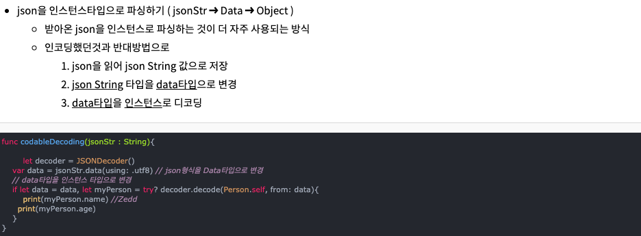
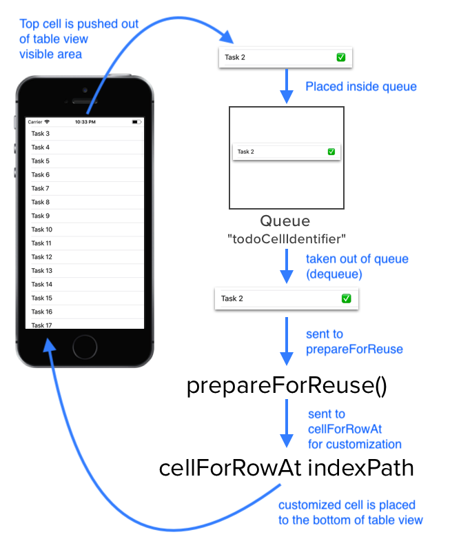

# [iOS] sunghun 개발과정

1. Editor ->. refectort to Storyboard 가면 스토리보드를 나눠줄 수 있음.
2. 로그인, 회원가입, 홈 UI,UX 만들기


## 오토레이아웃

- 오토레이아웃을 코드로 작성해서 적용해야할때 반드시,   addSubview로 먼저 버튼을 올리고 진행해야한다. 아래에 작성 

```swift
func addButton() {
        let button = ASAuthorizationAppleIDButton(authorizationButtonType: .signIn, authorizationButtonStyle: .black)
        
        button.addTarget(self, action: #selector(handleAuthorizationAppleIDButtonPress), for: .touchUpInside)
        
        button.translatesAutoresizingMaskIntoConstraints = false
        // 먼저 loginView에 버튼을 올리고 시작한다.
        LoginView.addSubview(button)
        
        button.leadingAnchor.constraint(equalTo: LoginView.leadingAnchor, constant: 30).isActive = true
        
        button.trailingAnchor.constraint(equalTo: LoginView.trailingAnchor, constant: 30).isActive = true
        button.topAnchor.constraint(equalTo: LoginView.topAnchor, constant: 30).isActive = true
        button.bottomAnchor.constraint(equalTo: LoginView.bottomAnchor, constant: 30).isActive = true
    }
```


### 메인스토리 보드 변경하는법

> 여러 스토리보드중 시작 스토리보드를 변경하고 싶을때 참고, General에서 main interface를 바꿔줘하고 **또, 반드시 Info-Application Scene Manifest 에서 해당 스토리 보드명으로 바꿔줘야함!**

- 참고 : https://stackoverflow.com/questions/58074878/xcode-11-main-interface-fixed-with-main-storyboard


## 이미지 플립

> 

```swift
import UIKit

class HomeViewController : UIViewController {
    
    @IBOutlet weak var scrollView: UIScrollView!
    
    override func viewDidLoad() {
        super.viewDidLoad()
        var images = [
            "image1",
            "image2",
            "image3",
            "image4",
        ]
        
        for i in 0..<images.count {
            let imageView = UIImageView()
            imageView.image = UIImage(named: images[i])
            imageView.contentMode = .scaleAspectFit
            // y축 포지션을 계속 변경시켜줌
            let yPosition = self.view.frame.height * CGFloat(i)
						// imageView의 프레임을 x,y좌표를 기준으로 정해주고 너비와 높이를 갖는 사격형이다. 
            imageView.frame = CGRect(x: 0, y: yPosition, width: self.view.frame.width, height: self.view.frame.height)
						// 스크롤 뷰의 컨탠츠 사이즈 높이를 정해준다.
            scrollView.contentSize.height =
                    self.view.frame.height * CGFloat(1+i)
            // 스크롤 뷰 위에 올리면 끝, addSubview는 이미지 뷰의
            scrollView.addSubview(imageView)
```

- view를 그리기 위해서는 반드시 알아야할 지식 - CGRect와 CGSized차이 : https://zeddios.tistory.com/201 

### frame과 boundsd의 차이

> 참고 : https://zeddios.tistory.com/203

1) Frame: SuperView(상위뷰)의 좌표시스템 안에서 View의 위치와 크기를 나타냄.

- Frame은 자신의 한단계 상위뷰, 자산의 부모뷰의 origin으로부터 떨어진 곳에 사각형을 그려주게 된다.

2) Bounds: 자신만의 좌표 시스템을 갖는다. 자신의 x,y 좌표를 갖는다. 

```swift
subView.bounds.origin.x = 60

subView.bounds.origin.y = 50
```

- **Bounds는 상위뷰 안에서의 좌표가 아닌 "자신만의 좌표시스템"을 가진다고 그랬죠? Bounds를 변경하는 것은 해당 위치에서 View를 다시그리라는 의미가 돼요. Bounds는 상위뷰와 아무런 관련이 없으므로, subView는 움직이지 않는 것 처럼 보이고 그 안에있던 imageView가 움직이는 것 처럼 보이는 것입니다.** 


## 콜렉션 뷰(UIcollectionView)

### UITableView와 UIcollectionView의 차이?

> 가장큰 차이는 컬렉션 뷰의 셀은 배경뷰가 있어서 배경을 넣고 그위에 콘텐츠를 작성하기에 편리하다는 것이다.

- 테이블뷰 셀의 구조는 콘텐츠 영역과 액세서리뷰 영역으로 나뉘었지만, 컬렉션뷰 셀은 배경뷰와 실제 콘텐츠를 나타내는 콘텐츠뷰로 나뉘었습니다.
- 테이블뷰 셀은 기본으로 제공되는 특정 스타일을 적용할 수 있지만 컬렉션뷰 셀은 특정한 스타일이 따로 없습니다.
- 테이블뷰 셀은 목록형태로만 레이아웃 되지만, 컬렉션뷰 셀은 다양한 레이아웃을 지원합니다.
- 커스텀하게 Layout을 설정할 수 있다. 

- 이런 이유들로 메인페이지에서 동영상을 보여줄떄 `UIcollectionView`를 쓰는게 맞다.

```swift
class HomeViewController : UIViewController{
    // 접근 제어
    private var collectionView: UICollectionView?
    
    private var data = [VideoModel]()
    
    override func viewDidLoad() {
        super.viewDidLoad()
        
        for _ in 0..<10 {
            let model = VideoModel(caption: "delicious chickhen", userName: "Yeom", placeName: "YumYumChickhen", addressName: "대전시 레자미 3차 802호", videoFileName: "video", videoFileFormat: "mp4", review: "노맛!!!!")
            
            data.append(model)
        }
        
        // layout 개겣를 생성하고
        let layout = UICollectionViewFlowLayout()
        layout.scrollDirection = .vertical
        // video 한개의 크기와 범위를 정해준다.
        layout.itemSize = CGSize(width: view.frame.size.width, height: view.frame.size.height)
        // 레이아웃에 마진주기
        layout.sectionInset = UIEdgeInsets(top: 0, left: 0, bottom: 0, right: 0)
        // 콜랙션 뷰의 객체를 frame 위치에 생성한다. frame : .zero 가로, 세로 0 좌표는 x:0 ,y :0 과 같다.
        collectionView = UICollectionView(frame: .zero, collectionViewLayout: layout)
        // 셀을 콜렉션 뷰에 등록한다.
        collectionView?.register(VideoCollectionViewCell.self, forCellWithReuseIdentifier: VideoCollectionViewCell.identifier)
        // 페이징 적용
        collectionView?.isPagingEnabled = true
        // 콜렉션 뷰를 사용하기 위해서는 반드시 dataSource를 delegate로 지정해줘함.
        collectionView?.dataSource = self
        view.addSubview(collectionView!)
    }
```

### 접근제어

> 코드끼리 상호작용할 때 파일 간 또는 모듈 간에 접근을 제한할 수 있는 기능이다. 접근 제어를 통해 코드의 상세 구현은 숨기고 허용된 기능만 사용하는 인터페이스를 제공할 수 있다.

- public :  자신이 구현된 소스 파일 물론, 그 소스파일이 속해 있는 모듈, 그 모듈을 가져다 쓴느 모듈 등 모든 곳에서 사용할 수 있다. 주로 외부와 연결될 인터페이스 구현을 하는데 많이 쓰인다. Model 파일을 public으로 지정해서 쓰기도함.
- private :  접근 수준이 가장 한정적인 범위, 소스파일 내부에서만 사용할 수있으며, 심지어 같은 파일안에 구현한 다른 타입이나 기능에서도 사용할 수가 없다. 


### viewDidLayoutSubviews

> 뷰가 서브 뷰의 레이아웃을 변경한 후에 호출되는 메서드이다.


### bundle의  path 함수

> 이름과 파일 확장자를 통해서 정의된 리소스의 full pathname을 반환한다.

- 그냥 스트링으로 넣으면 안되나?? 그러면 하드코딩되는 형식이 되서 안된다. 

```swift
let jsonPath = "/Users/kangsujin/Desktop/boostcourse/Weather/Weather/Weather/Data/countries.json"
String(contentsOfFile: jsonPath)
```

- 파일 이름과 타입을 정해주면 파일 경로를 리턴시켜 준다.

```swift
 guard let path = Bundle.main.path(forResource: model.videoFileName, ofType: model.videoFileName) else {
            return
        }
```


### 코드로 콜랙션 뷰 짜기

> 커스텀을 코드로 미세하게 할 수 있는것 같지만 너무 많은 시간과 노력이 들어서 실제 개발할때는 이런 방식으로 하면 안될 것 같습니다. 

- HomeViewController.swift

```swift
//
//  HomeViewController.swift
//  YumYum
//
//  Created by 염성훈 on 2021/04/15.
//

import UIKit

// 화면에 담길 Label을 모델로 만든다.
struct VideoModel{
    let caption : String
    let userName : String
    let placeName : String
    let addressName : String
    let videoFileName : String
    let videoFileFormat : String
    let review : String
}

class HomeViewController : UIViewController{
    // 접근 제어
    private var collectionView: UICollectionView?
    
    private var data = [VideoModel]()
    
    override func viewDidLoad() {
        super.viewDidLoad()
        
        for _ in 0..<10 {
            let model = VideoModel(caption: "delicious chickhen", userName: "Yeom", placeName: "YumYumChickhen", addressName: "대전시 레자미 3차 802호", videoFileName: "video", videoFileFormat: "mp4", review: "노맛!!!!")
            
            data.append(model)
        }
        
        // layout 개겣를 생성하고
        let layout = UICollectionViewFlowLayout()
        layout.scrollDirection = .vertical
        // video 한개의 크기와 범위를 정해준다.
        layout.itemSize = CGSize(width: view.frame.size.width, height: view.frame.size.height)
        // 레이아웃에 마진주기
        layout.sectionInset = UIEdgeInsets(top: 0, left: 0, bottom: 0, right: 0)
        // 콜랙션 뷰의 객체를 frame 위치에 생성한다. frame : .zero 가로, 세로 0 좌표는 x:0 ,y :0 과 같다.
        collectionView = UICollectionView(frame: .zero, collectionViewLayout: layout)
        // 셀을 콜렉션 뷰에 등록한다.
        collectionView?.register(VideoCollectionViewCell.self, forCellWithReuseIdentifier: VideoCollectionViewCell.identifier)
        // 페이징 적용
        collectionView?.isPagingEnabled = true
        // 콜렉션 뷰를 사용하기 위해서는 반드시 dataSource를 delegate로 지정해줘함.
        collectionView?.dataSource = self
        view.addSubview(collectionView!)
    }
    
    override func viewDidLayoutSubviews() {
        super.viewDidLayoutSubviews()
        collectionView?.frame = view.bounds
    }
}

extension HomeViewController: UICollectionViewDataSource{

    // 지정된 섹션에 표시할 항목의 갯수를 묻는 매서드.(필수)
    func collectionView(_ collectionView: UICollectionView, numberOfItemsInSection section: Int) -> Int {
        return data.count
    }
    // 콜렉션 뷰의 특정 인덱스에서 표시할 셀을 요청하는 메서드이다.(필수)
    func collectionView(_ collectionView: UICollectionView, cellForItemAt indexPath: IndexPath) -> UICollectionViewCell {
        
        let model = data[indexPath.row]
        let cell = collectionView.dequeueReusableCell(withReuseIdentifier: VideoCollectionViewCell.identifier, for: indexPath) as! VideoCollectionViewCell
        
        cell.configure(with: model)
        
        return cell
    }
        
}

```

- VideoCollectionViewCell.swift

```swift
//
//  VideoCollectionViewCell.swift
//  YumYum
//
//  Created by 염성훈 on 2021/04/16.
//

// videocell 한개이고 비디오 한 화면에 담기는 것들을 제어한다.
import UIKit
import AVFoundation

protocol VideoCollectionViewCellDelegate : AnyObject{
    func didTapLikeButton(with model: VideoModel)
    func didTapShareButton(with model: VideoModel)
}

class VideoCollectionViewCell: UICollectionViewCell {
    
    static let identifier = "VideoCollectionViewCell"
    
    // Labels 객체
    private let userNameLabel: UILabel = {
        let label = UILabel()
        label.textAlignment = .left
        label.textColor = .white
        return label
    }()
    
    private let captionLabel: UILabel = {
        let label = UILabel()
        label.textAlignment = .left
        label.textColor = .white
        return label
    }()
    
    private let placeNameLabel: UILabel = {
        let label = UILabel()
        label.textAlignment = .left
        label.textColor = .white
        return label
    }()
    
    private let addressNameLabel: UILabel = {
        let label = UILabel()
        label.textAlignment = .left
        label.textColor = .white
        return label
    }()
    
    private let reviewLabel: UILabel = {
        let label = UILabel()
        label.textAlignment = .left
        label.textColor = .white
        return label
    }()
    
    //Buttons 객체
    private let likeButton: UIButton = {
        let button = UIButton()
        button.setBackgroundImage(UIImage(systemName: "heart.fill"), for: .normal)
        return button
    }()
    
    private let shareButton: UIButton = {
        let button = UIButton()
        button.setBackgroundImage(UIImage(systemName: "arrowshape.turn.up.right.fill"), for: .normal)
        return button
    }()
    
    private let videoContainer = UIView()
    
    
    //Delegate : 버튼의 이벤트를 처리해줄 델리게이트 패턴 지정
    weak var delegate : VideoCollectionViewCellDelegate?
    
    // SUbviews
    var player : AVPlayer?
    
    private var model: VideoModel?
    
    override init(frame:CGRect){
        super.init(frame:frame)
        contentView.backgroundColor = .red
        contentView.clipsToBounds = true
        addSubviews()
    }
    
    private func addSubviews() {
        
        contentView.addSubview(videoContainer)
        
        contentView.addSubview(userNameLabel)
        contentView.addSubview(captionLabel)
        contentView.addSubview(placeNameLabel)
        contentView.addSubview(addressNameLabel)
        contentView.addSubview(reviewLabel)
        
        contentView.addSubview(likeButton)
        contentView.addSubview(shareButton)
        
        // Add actions
        likeButton.addTarget(self, action: #selector(didTapLikeButton), for: .touchDown)
        shareButton.addTarget(self, action: #selector(didTapShareButton), for: .touchDown)
        
        videoContainer.clipsToBounds = true
        
        contentView.sendSubviewToBack(videoContainer)
    }
    
    @objc private func didTapLikeButton() {
        guard let model = model else { return }
        delegate?.didTapLikeButton(with: model)
    }
    
    @objc private func didTapShareButton() {
        guard let model = model else { return }
        delegate?.didTapShareButton(with: model)
    }
    
    override func prepareForReuse() {
        super.prepareForReuse()
        captionLabel.text = nil
        userNameLabel.text = nil
        placeNameLabel.text = nil
        addressNameLabel.text = nil
        reviewLabel.text = nil
    }
    
    override func layoutSubviews() {
        super.layoutSubviews()
        let size = contentView.frame.size.width/6
        let width = contentView.frame.size.width
        let height = contentView.frame.size.height
        
        videoContainer.frame = contentView.bounds
        
        likeButton.frame = CGRect(x: width-size, y: height-size, width: size, height: size)
        shareButton.frame = CGRect(x: width-size, y: height-(size*2)-10, width: size, height: size)
        
    }
    
    // 여기서 with는 외부참조 변수이다.
    public func configure(with model: VideoModel){
        self.model = model
        configureVideo()
        
        //labels를 model의 값과 동일하게 맞춰준다.
        captionLabel.text = model.caption
        userNameLabel.text = model.userName
        placeNameLabel.text = model.placeName
        addressNameLabel.text = model.addressName
        reviewLabel.text = model.review
    }
    
    private func configureVideo() {
        guard let model = model else {
            return
        }
        
        guard let path = Bundle.main.path(forResource: model.videoFileName, ofType: model.videoFileFormat) else {
            print("파일을 찾지 못했어요!")
            return
        }
        // AVPlayer는 URL 객체를 넘겨줘야한다.
        player = AVPlayer(url: URL(fileURLWithPath: path))
        
        // 비디오 레이아웃을 커스텀하기 위해 사용한다.
        // AVPlaterLayer 개겣를 생성하고 player를 넣는다.
        let playerView = AVPlayerLayer()
        playerView.player = player
        playerView.frame = contentView.bounds
        // 비디오를 화면 꽉차게 만드는 것 layer의 bounds에 맞춰서 채워진다 비율도 맞게
        playerView.videoGravity = .resizeAspectFill
        videoContainer.layer.addSublayer(playerView)
        player?.volume = 0
        player?.play()
    }
    
    required init?(coder: NSCoder) {
        fatalError("init(coder:) has not been implemented")
    }
}
```

### 컬렉션 뷰 셀

- 컬렉션뷰 셀은 두 개의 배경을 표시하는 뷰와 하나의 콘텐츠를 표시하는 뷰로 구성되어 있습니다. 두 개의 배경뷰는 셀이 선택되었을 때 사용자에게 시각적인 표현을 제공하기 위해 사용됩니다.
- 셀의 레이아웃은 컬렉션 뷰의 레이아웃 객체에 의해 관리된다.
- `var contentView: UIView` : 셀의 콘텐츠를 표시하는 뷰입니다.
- `var backgroundView: UIView?` : 셀의 배경을 나타내는 뷰입니다. 이 프로퍼티는 셀이 처음 로드되었을 경우와 셀이 강조 표시되지 않거나 선택되지 않을 때 항상 기본 배경의 역할을 합니다.
- `var selectedBackgroundView: UIView?` : 셀이 선택되었을 때 배경뷰 위에 표시되는 뷰입니다. 이 프로퍼티는 셀이 강조 표시되거나 선택될 때마다 기본 배경 뷰인 `backgroundView`를 대체하여 표시됩니다.


## 테이블 뷰(UITableView)

> 목록형태로 나태낼때 사용하기 좋은 메서드 이다.

- 홈 화면을 구성할때 테이블 뷰를 써야할지 콜렉션 뷰를 써야할지 너무 고민됬는데 간단한 목록 구현이라면 그냥 테이블 뷰를 사용하는게 더 좋아보인다.


## 서버연동

> RestAPI로 구성된 URL로 호출을 보내면 값을 돌려받을 수 있다.


### GET 방식

> Alamofie

- VideoCollectionViewCell


#### 문법

- let 과 var : let은 불편 프로퍼티, var는 가변 프로퍼티를 말한다.
- static이 붙게 되면 그 변수가 타입 프로퍼티라는 말이 되는데, 타입 프로퍼티는 그 구조체, 및 클래스 내부에서 사용되는 메서드를 사용할때 적용된다.
- 가끔 보다보면 클래스인데 인스턴스를 안만들고 함수를 사용하는 경우가 있는데 클래스(타입)안의 메소드가 `static func ~~` 로 되어 있으면 클래스를 그대로 가져와서 함수를 사용할 수 있다.


### extension 

> 말 그대로 확장의 의미로 뒤에 오는 컨트롤러를 상속받는 모든 클래스는 extension 아래에 지정된 메서드를 사용할 수 있다.

```swift
// UIViewContoller를 사용하는 모든 클래스에서 아래에 작성된 메서드를 호출해서 사용할 수 있다.
extension UIViewController {
    
}

```


## 동기와(sync)와 비동기(async)

```swift
     DispatchQueue.main.async {
            // Main 큐에서 비동기 방식으로 실행할 코드
        }
        DispatchQueue.global().async {
            // Background 큐에서 비동기 방식으로 실행할 코드
        }
        DispatchQueue.main.sync {
            // Main 큐에서 동기 방식으로 실행할 코드인데 이거 쓰면 오류가 발생할 확률이 있음.
        }
        DispatchQueue.global().sync {
            // Background 큐에서 동기방식으로 실행할 코드
        }
```

- `DispatchQuque.main.async` 으로 실행하는 동안 UI가 멈춰져 있게된다. (= UI상호 작용이 불가하다)  단, UI를 변경하는 코드는 Main 스레드에서 실행하도록 해야한다.

```swift
var str = ""
DispatchQueue.global().async {
  Thread.sleep(forTimeInterval: 3)
  str = "finished"
  DispatchQueue.main.async {
    self.label.text = str // UI가 변경되는 부분은 여기서 실행시켜줘야하는데, 이부분은 짦기 떄문에 오래걸리는 부분의 코드는 위에 작성하고 조금 걸리는 코드는 여기에 작성하면된다. DispatchQueue.global().async는 백그라운드에서 실행되기 떄문이다.
  }
}
```

### 구글 로그인

- 앱델리게이트 말고 viewcontroller에서 화면 전환 시키는 방법 : https://stackoverflow.com/questions/36520067/google-login-in-login-view-controller-instead-of-appdelegate-ios-swift

- 로그인 후 사용자 정보 받아올때 파라미터들

```swift
        // 사용자 정보 가져오기
        if let userId = user.userID,                  // For client-side use only!
//            let idToken = user.authentication.idToken, // Safe to send to the server
//            let fullName = user.profile.name,
//            let givenName = user.profile.givenName,
//            let familyName = user.profile.familyName,
            let email = user.profile.email {
            
            // 도대체 왜!! 와이 전체 user가 안담기냐고!!!! 주길까 일단 userId만 담자
            let plist = UserDefaults.standard
            plist.set(email, forKey: "userEmail")
            plist.synchronize()
            
        } else {
            print("Error : User Data Not Found")
        }
```


### enum(열거형)

> case를 나눠서 enum `type` 을 갖는 것의 값을 불러서 올수 잇다. 객체에

- 참고 : https://zeddios.tistory.com/12


### DispatchQueue

- 이미지가 클경우에 다운로드 받기 까지 잠깐의 멈춤이 있을 수가 있다.(이유: 싱글 쓰레드로 작동되기 때문이다.) 그러나 DispatchQueue를 쓰면 멀티 쓰레드로 되어 이미지가 클 경우에도 멈춤이 생기지 않는다.
- 참고: https://zeddios.tistory.com/516 , https://m.blog.naver.com/jdub7138/220949191761
- sync : 동기적인 처리로 sync로 지정해준 로직이 끝나기 전까지 다른 작업을 하지 않는다.
- Async: 비동기 처리로 아래 로직의 완료 여부와 상관없이 다음 코드가 실행됩니다.

```swift
        DispatchQueue.global().async {
          //.global()을하는 이유는 .main으로 했을 경우에 유저가 이미지를 불러오도록 지시를 받아오는 중에 유저가 화면 이동이나 클릭 등을 할 수 있게 해준다.
            let data = try? Data(contentsOf: url!)
            DispatchQueue.main.async {
                image = UIImage(data: data!)
                self.myProfileImgView.image = image
            }
        }
```

- 작업의 우선순위를 정의한 QoS를 활용할 수가 있다.(4가지가 있음) 1. `userInteractive` 2) `userlnitiated` 3) `utility` 4) `background`


### 클래스

- 클래스는 반드시 초기값이 있어야한다.


### 연산 프로퍼티(computed property)

- 말그대로 값을 저장하는 것이아닌 그떄그때 특정한 연산을 통해서 값을 리턴해준다.

- getter와 setter로 이뤄져 있고 연산된 값을 저장할 변수가 반드시 있어야한다.

```swift
class Point {
    var tempX : Int = 1
    var x: Int {
        get {
            return tempX
        }
        set {
            tempX = newValue * 2
        }
    }
}
var p: Point = Point()
p.x = 12

```

- 위처럼 하면 x에 값이 저장되는 것이 아니라 tempX에 두배를 한 24가 저장된다. 즉 x에 저장되는게 아니라 클래스 Point안의 저장 프로퍼티인 tempX에 24가 저장되는 것이다.
- get은 값을 호출할때 현재 저장되어 있는 값을 그대로 불러오고
- 연산 프로퍼티에 값을 넣어주면 set으로 들어가서 연산을 마치고 그 값을 구조체나, 클래스에 저장된 저장프로퍼티에 저장시켜놓는다.

## codable 프로토콜

- 처음에는 이걸 왜쓰나 싶었다. 그냥 alamofire로 받아온 JSON객체를 파싱해서 데이터 객체로 저장하고 예를들면 NSDictionary라든지 JSONArray라면 NSArray라든지 그런데 계속 하나씩 다 파싱하다보니까 효율성이 너무 떨어지는 걸 느꼈고 받아온 데이터를 struct로 지정해놓고 서버에서 받아온 데이터를 내가 struct에 지정한 타입으로 틀 찍어내듯이 하면 간편하다는 것을 알았다. 

- 주로 서버에서 받아온 JSON을 decoder를 이용해서 디코딩하는경우가 많기 때문에 다음과 같이 하면된다.

- 

- 여기서 decode 코드이 원형이 Person.self가 들어간 자리의 type: 인데 이는 우리가 JSON으로 만들고 싶은것의 타입을 넣어주면된다. 그래서 Person.self로 Person 클래스, 혹은 구조체의 타입을 넣어주면 타입을 지정해 줄 수가 있다.


## Singleton(싱글톤)

> 특정용도의 객체를 하나 생성해서 공용으로 사용하고 싶을떄 사용하는데, 주로 환경설정, 로그인 정보 등을 특정용도로 생성해둔 객체에 넣어두고 여러 객체에서 접근 가능하도록 하여 데이터를 사용하게 하는 것이다. 메모리를 딱 한번만 쓰기 때문에 메모리 소모가 적다.

```swift
final class ElonMusk {

    static let shared = ElonMusk()

    private init() {
        // Private initialization to ensure just one instance is created.
    }
}
```

- 이처럼 클래스를 선정하고 타입 프로퍼티에 자기 자신의 클래스를 넣는다. 싱글톤은 딱 한번만 메모리에 올라가야하므로 접근제어자(private)를 사용해서 init()이 한번만 일어나게 한다.


## 제네릭(Generic)

- 참고 : https://zeddios.tistory.com/226


### 어려움을 겪었던 문제

- 회원정보 수정시 프로필을 안바꾸고 별명과 소개만 바꿨을때 현재 프로필은 그래도 유지시키는 것이 어렵다.

- 현재 userDefaults에 있는 profilePath를 꺼내오고 그걸 저장할떄 넣어주면되는데 두가지 조건이 생겨서 오래걸렸음

```swift
  let tempprofilePath: String = userData!["profilePath"].stringValue
        
        user.id = userData!["id"].intValue
        user.nickname = self.nickNameTF.text
        user.introduction = self.introduceTF.text
        print(tempprofilePath.isEmpty)
        
        if tempprofilePath.isEmpty , user.profilePath == nil  {
            user.profilePath = ""
        } else if tempprofilePath.isEmpty == false, user.profilePath == "" {
            user.profilePath = tempprofilePath
        }
```

## EscapingClosure

> 참고 : https://jusung.github.io/Escaping-Closure/

- 함수 밖에서 호출되었을떄 비로소 그 구문이 실행된다.

```swift
	func getFeedList(userId: Int, success: @escaping (JSON) -> Void, failure: @escaping (Error) -> Void) {
        let url = "\(domainUrl)\(feedUrl)/list/\(userId)"
        AF.request(url, method: .get)
          .responseJSON {(response) in
            switch response.result {
            case .success(_):
                let json = JSON(response.value!)
                //아래 success는 외부에서 호출할떄 실행된다.
                success(json)
                break
                
            case .failure(_):
                let error: Error = response.error!
                failure(error)
                break
            }
        }
    }
```

- 위에서 보면 getFeedList()에서서 사용되는 success와 failure 함수는 즉시 실행되지 않고 URL요청이 끝나고 비동기적으로 실행이된다.
- 즉, getFeedList 함수의 실해ㅐㅇ이 먼저 종료되고 값을 반환한 다음에 success가 외부에서 호출되었을떄 실행된다고 보면된다.
- JSON으로 받아온 데이터를 처리하고 **그 값을 반환하기위해서 escaping을 사용하고 함수 외부에서** 접근하도록하는 것이다.
- 간단하게 생각하면 데이터를 전달 받고나서 그 값을 함수 밖에서 사용하기 위해서이다. 


## 영상무한재생

> AVplayer를 계속해서 재생 시키기 위한 코드를 적어놉니다.

```swift
        var playerLooper: AVPlayerLooper!
                var queuePlayer: AVQueuePlayer!
        
                let asset = AVAsset(url: feed.videoPath!)
                let playerItem = AVPlayerItem(asset: asset)
                queuePlayer = AVQueuePlayer(playerItem: playerItem)
                playerLooper = AVPlayerLooper(player: queuePlayer, templateItem: playerItem)
                
                NotificationCenter.default.addObserver(forName: .AVPlayerItemDidPlayToEndTime, object: self.player?.currentItem, queue: .main) { [weak self] _ in
                    self?.player?.seek(to: CMTime.zero)
                    self?.player?.play()
                    let playerView = AVPlayerLayer()
                    playerView.player = self!.player
                    playerView.frame = self!.videoLayout.bounds
                    playerView.videoGravity = .resize
                }
```

## isUserInteractionEnabled

> 유저의 이벤트가 event queue로 부터 무시되고 삭제됐는지 판단하는 Bool값이다.

- false : view를 위한 touch, press, keyboard 이벤트가 무시되고 삭제된다.
- true : true로 set해야 이벤트가 정상적으로 view에 전달되게 된다. 기본적으로 value는 true이다.


## 재사용셀로 인해 발생되는 문제

> 테이블 뷰와 컬렉션 뷰를 설계할때 그냥 셀을 사용하지 않고 재사용셀을 사용한다. 메모리에 1만개의 셀을 다 갖고 있어야하기 때문에 메모리 관리 차원에서 비효율적인데 그래서 이 셀을 재활용하는데 셀의  UI(이미지, 버튼, 레이블) 그리고 속성들이 중첩되거나 반복되는 경우가 생기게 된다.

- 발생한 문제는 현재 평점에 따라 애니메이션 아이콘이 동작해야하는데 재사용 셀을 사용하다보니 중첩되는 경우가 발생했다.
- 이 문제를 해결하기 위해서는 해당 인덱스의 상태를 기억하고 있어야한다. 델리게이트로 값을 넘기는  방법으로 해결
- VideoCollectionViewCell.swift

```swift
var index : Int = 0
var delegate: userProfileBtnDelegate?
.....//델리게이트 변수에 프로토콜을 지정하고
@IBAction func userBtnPress(_ sender: Any) {
  	self.delegate?.userBtnPress(index: index, nowfeed: nowFeed)
}// 버튼을 클랙했을때 collectionviewCell.델리게이트 안의 함수를 호출해서 값을 넘겨준다.
.....
protocol userProfileBtnDelegate {
    func userBtnPress(index: Int, nowfeed : Feed)
    func saveScoreState(index: Int, nowfeed: Feed)
}
```

- HomeVc.swift

```swift
//값을 전달받을 viewController에서 프로토콜을 채택하고 전달 받은 값을 사용해주면된다.
extension HomeVC:userProfileBtnDelegate {
    func saveScoreState(index: Int, nowfeed: Feed) {
        switch nowfeed.score! {
        case 1:
            Scores[index] = 1
        case 2:
            Scores[index] = 2
        case 3:
            Scores[index] = 3
        case 4:
            Scores[index] = 4
        case 5:
            Scores[index] = 5
        default:
            print("평점값이 없어요!")
        }
    }
   func userBtnPress(index: Int, nowfeed: Feed) {
        let storyboard: UIStoryboard? = UIStoryboard(name: "Home", bundle: nil)
        
        guard let peopleVC = storyboard?.instantiateViewController(withIdentifier: "PeopleVC") as? PeopleVC else {
            return
        }
        
        peopleVC.userId = nowfeed.user?.id!
        peopleVC.username = nowfeed.user?.nickname!
        
        WebApiManager.shared.getUserInfo(userId: (nowfeed.user?.id!)!) { (result) in
            if result["status"] == "200"{
                let results = result["data"]
                peopleVC.userData = User(json: results)
                self.navigationController?.pushViewController(peopleVC, animated: true)
            }
        } failure: { (error) in
            print(error)
        }
    }
```

### **더 쉬운 방법이 있었다.**

> 참고 : https://sihyungyou.github.io/iOS-dequeueReusableCell/

- 테이블 뷰 셀은 `prepareForReuse` 함수ㅡㄹㄹ 제공하는데 여기서 셀 뷰 측면의 속성들을 초기화 시켜주면 된다.
- 

- 위의 그림을 보면 좀 더 명확하게 이해가 가는데 코드적으로`prepareForReuse()`로 들어가서 한번 초기화가 되고 셀을 구성하는 `cellForRowAt indexPath`로 들어가게된다.

- 즉 `prepareForReuse()`에서 재사용되는 셀의 속성을 초기화시켜주면된다.
- 애니메이션을 스탑시키고 매번, 그리고 그다음에 `cellForRowAt` 에 들어가서 애니메이션 플레이 효과를 주면 된다.

 ```swift
 //videoCollectionViewCell.swift
 override func prepareForReuse() {
         super.prepareForReuse()
         animationview.stop()
         animationview2.stop()
         animationview3.stop()
         animationview4.stop()
         animationview5.stop()
     }
 
 //HomeVC.swift
  func collectionView(_ collectionView: UICollectionView, cellForItemAt indexPath: IndexPath) -> UICollectionViewCell {
    ...
      switch feed.score! {
         case 1:
             cell.animationview.play()
             cell.animationview.loopMode = .loop
 //            animationview.setValueProvider(colorProvider, keypath: keypath)
             break
         case 2:
             cell.animationview2.play()
             cell.animationview2.loopMode = .loop
 //            animationview2.setValueProvider(colorProvider, keypath: keypath)
             break
         case 3:
             cell.animationview3.play()
             cell.animationview3.loopMode = .loop
 //            animationview3.setValueProvider(colorProvider, keypath: keypath)
             break
         case 4:
             cell.animationview4.play()
             cell.animationview4.loopMode = .loop
 //            animationview4.setValueProvider(colorProvider, keypath: keypath)
             break
         case 5:
             cell.animationview5.play()
             cell.animationview5.loopMode = .loop
 //            animationview5.setValueProvider(colorProvider, keypath: keypath)
             break
         default:
             print("평점 값이 없습니다.")
             cell.animationview.pause()
             cell.animationview2.pause()
             cell.animationview3.pause()
             cell.animationview4.pause()
             cell.animationview5.pause()
         }
         return cell
    
    
 ```

## 화면전환

> 그냥 화면전환은 쉬웠다. 근대 모달로 한번 화면이 띄워지고 또 다른 스토리보드의 네비게이션 바로 이동을 해야할떄 문제가 발생했다. 

1) 먼저 모달 Viewcontroller(MyFeedVC.swift)에  present될때 navigationController를 같이보내서 넣어줘야한다. 왜냐하면 navigationConroller가 전달되지 않으면 모달은 띄워지지만 모달(MyFeedVC)에서 버튼을 클릭해서 다른 네비게이션 컨트롤러(ReviewVC)로 이동할 수가 없음 왜냐? `self.navigationController` 가 널값이기 떄문이다. 따라서 아래와 같이 넣어줘야한다.

- MyPageVC.swift

```swift
// 현재 
let navigationController = UINavigationController(rootViewController: vc)
navigationController.modalPresentationStyle = .fullScreen
self.present(navigationController, animated: true)
```


## tabbar Icon Size

- svg파일로 탭바 아이콘을 변경할때, 즉 내가 원하는 이미지로 바꿔줄때 발생했는데 사이즈가 탭바에 들어가면 줄지 않는다는 것이다. 우선 ios에서는 13.0이상 버전부터 svg파일을 적용시킬 수 있기 때문에 같은 벡터 파일인 pdf파일로 변환시켜 적용하는 것이 중요하다!

- https://developer.apple.com/design/human-interface-guidelines/glyphs/overview/ 그리고 이 가이드라인에 맞춰서 pdf파일의 크기를 줄여줘야한다. 
- 파일  변환  URL: https://cloudconvert.com/svg-to-pdf
- 파일 다운로드 URL : https://www.iloveimg.com/ko/download/Agf8zjr4rz728b3AmkhlztvshAmjjzl9v8ffqqnsAml88gfcvq3fnp810Aknt6qb230tlyf8mpv2j5n41ApvgjA0w5tst68s2d5wmcbmbtwyw7gAf7775dtfsbl0wydAlfA5yx4hf43prmdgxtcsflqtx8gn4fc65ph7A3A05178f8nts9n1/6


## 서버로 비디오 및 이미지 요청 보낼시

> 반드시 헤더랑, 바디에 뭘담아 줘야할지 생각하고 하자... 그리고 ios에서는 dump다 찍어보고 success로 오더라도 400에러로 bedrequest올수도 있으니까 꼭 확인 것
