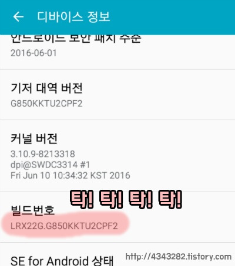
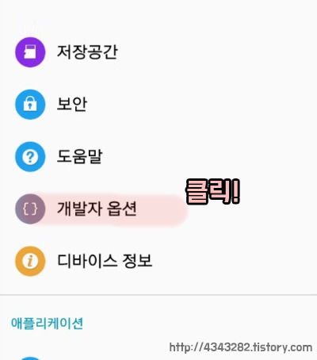
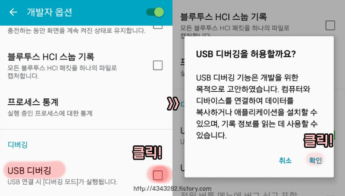
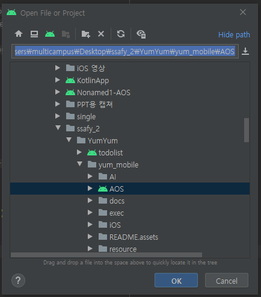
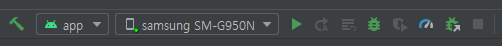

# 안드로이드 포팅

### 1. 안드로이드 휴대폰 디버깅 모드로 설정

1. 설정 > 디바이스 정보 > 빌드 번호 연속 클릭(막 눌러주세요)

2. 개발자 모드가 활성화 됩니다.

3. USB 디버깅모드 활성화합니다.

출처 - https://4343282.tistory.com/267

### 2. 안드로이드 스튜디오를 설치

아래 링크에서 안드로이드 스튜디오를 설치합니다.

https://developer.android.com/studio?hl=ko

### 3. 안드로이드 스튜디오로 AOS 폴더를 엽니다.

### 4. 디버깅 모드를 세팅한 휴대폰과 컴퓨터를 USB 연결합니다.

Running Device를 실제 기기에 세팅하고 Run 버튼을 누릅니다.